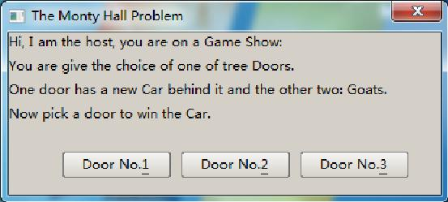
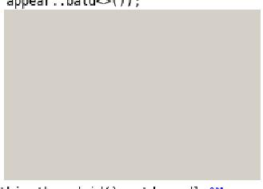

# 5. Creating forms #

This chapter will teach you how to create a window using Nana C++ Library. 
A window is a visual element in the operation system or window environment. 
Form is a window that like a container can contain other widgets, such as button, 
textbox and listbox. Every GUI program created with the Nana C++ Library need to create one 
form at least, as in examples of chapter 1. Many forms are created by creating an instance of form. 
This way of creating a form is easy, but it will make your program complicated if you want to create a bit larger program.
 
## 5.1, Defining a form through Derivation ##
Nana C++ Library is implemented using Object-oriented methods. We can define an own form by deriving from nana::gui::form. 

Our first example is a Monty Hall Problem. This is a game that tests you whether change your choice after you picked a door to win a new Car. 

 

Let’s start creating this application. First we are going to design architecture for the application. 
As we saw in figure 3.1, the application needs a form, a label and three buttons. 

	1 #include <nana/gui/wvl.hpp> 
	2 #include <nana/gui/widgets/label.hpp> 
	3 #include <nana/gui/widgets/button.hpp> 
	4 #include <nana/system/platform.hpp> 
	5 class monty_hall 
	6       : public nana::gui::form 
	7 { 
	8     enum state_t{state_begin, state_picked, state_over}; 
	9   public: 
	10    monty_hall(); 
	11  private: 
	12    void _m_pick_door  (const nana::gui::eventinfo& ei); 
	13    void _m_play       (int door); 
	14    void _m_remove_door(int exclude); 
	15  private: 
	16    state_t    state_; 
	17    int        door_has_car_; 
	18    nana::gui::label  label_; 
	19    nana::gui::button door_[3]; 
	20 }; 
	21 int main() 
	22 { 
	23    monty_hall mh; 
	24    mh.show(); 
	25    nana::gui::exec(); 
	26 } 

Lines 1 to 4 include the headers that are required by this application. 
The wvl.hpp provides the basis of Nana C++ Library that all GUI program required. label.hpp 
and button.hpp include the definitions of label and button, and we will specify the door which 
has the new Car randomly by using timestamp()- platform.hpp provides the timestamp() function. 

Lines 5 to 20 define the class monty_hall. The monty_hall is derived from nana::gui::form, 
in another word, class monty_hall is defined as a form and we will put all handlers in this 
class scope to keep program clear. 

Line 8 defines a state type that contains three states. state_begin is a state that indicates 
the first pick, state_picked indicates the second pick, and state_over indicates the result. 

Line 10 declares a default constructor. It will initialize the widgets and set the initial state. 

Line 12 declares a private member function to respond the user action on buttons. 

Line 13 and 14 declare two private member functions which handle the game logic. We will define them later.
 
Lines 16 to 19 define the data members including label and buttons. The integer member door_has_car_ indicates the number of the door which has a car behind it.
 
Lines 21 to 26 define the main function; an object of class monty_hall is defined, sets the form visible and enters the event loop.
 
Let’s implement the default constructor and three private member functions. 

	27 monty_hall() 
	28        : nana::gui::form(nana::gui::API::make_center(400, 150), 
	29                                                        appear::decorate<appear::taskbar>()) 
	30         ,state_(state_begin) 
	31 { 
	32    this->caption(STR("The Monty Hall Problem")); 
	33    nana::string text = STR("Hi, I am the host, you are on a Game Show:\n") 
	34    STR("You are given the choice of one of tree Doors.\n") 
	35    STR("One door has a new Car behind it and the other two: Goats.\n") 
	36    STR("Now pick a door to win the Car."); 
	37 
	38    label_.create(*this, 0, 0, 400, 100); 
	39    label_.caption(text); 
	40 
	41    nana::string door_name[3] = 
	42                              {STR("Door No.&1"), STR("Door No.&2"), STR("Door No.&3")}; 
	43    for(int i = 0; i < 3; ++i) 
	44    { 
	45      door_[i].create(*this, 50 + 110 * i, 110, 100, 24); 
	46      door_[i].caption(door_name[i]); 
	47      door_[i].make_event<nana::gui::events::click>(*this, 
	48                                                          &monty_hall::_m_pick_door); 
	49    } 
	50 } 

Line 28 and 29 initialize the base class of monty_hall. make_center() is a function that returns 
a rectangle that specifies an area in the center of screen with size of 400 × 150. The typedef name 
appear is used for the abstraction of form appearance. The appear::decorate defines the form with caption 
bar, border, a close button and displaying in taskbar. 

Line 30 initializes the initial state. 

Line 32 sets the caption of form. 

Lines 33 to 36 define a text that describes the game information. 

Line 38 and 39 create a label widget and set the caption of label. The label will display the text which is defined in line 33. 

Line 41 and 42 define a string array which contains the names of three doors. 

Lines 43 to 48 create the buttons in a loop, and set the caption, make a click event for three buttons. 

	51 void _m_pick_door(const nana::gui::eventinfo& ei) 
	52 { 
	53 	int index = 0; 
	54 	for(; index < 3; ++index) 
	55 	{ 
	56 		if(door_[index] == ei.window) 
	57 		   break; 
	58 	} 
	59 	_m_play(index); 
	   } 

On line 51, the member function has a parameter, eventinfo that contains the event 
information, such as which widget the event is taking place. We need the information to 
determinate which button is clicked, because the event handler of the three buttons is one 
and the same. 

Lines 53 to 59 find the index of the button which is clicked. The button which is click is specified by ei.window. _m_play() handles the logic of game. 

	60 void _m_play(int door) 
	61 { 
	62    switch(state_) 
	63    { 
	64       case state_begin: 
	65                      door_has_car_ = (nana::system::timestamp() / 1000) % 3; 
	66                      _m_remove_door(door); 
	67                      state_ = state_picked; 
	68                 break; 
	69       case state_picked: 
	70                      label_.caption(door_has_car_ == door ? 
	71                                        STR("Yes, you win the new Car!!") : STR("Sign, you are lost!")); 
	72                      state_ = state_over; 
	73                 break; 
		  } 
	   } 
Line 60 defines the _m_play() to handle the logic of this game, it contains a parameter to indicate 
what the number of door is picked. There are two states we would handle, state_begin indicates the 
first pick, and now, program should put the car behind a door randomly, use the timestamp() function 
to retrieve the number of milliseconds that have elapsed since system was started, we use the number 
to implement randomization, and find the remainder of division of the number by 3 through the modulus 
operation, the last result is the door number which is large or equal to 0 and less than 3. _m_remove_door() 
is used for removing a door excluding the car behind it and the door that is picked. 

Line 67 is setting the next state. 

Line 69 is start of handling the state that gamer plays the second pick. 

Line 70 and 71 test the number of door whether is the door which the car behind it, and set the caption of label by result. 

Line 72 sets the final state. 

In fact, in the lines from 51 to 59, the member function _m_pick_door() can be removed by using 
std::bind(), refer to section 2.3 Think about the Design. By using std::bind(), we can bind the 
the index of door to the _m_play() and make it as the event handler for the click of button. 

	74 void _m_remove_door(int exclude) 
	75 { 
	76 		std::vector<int> doors; 
	77 		for(int i = 0; i < 3; ++i) 
	78 		{ 
	79 			if(i != exclude) 
	80 				doors.push_back(i); 
	} 
	81 		unsigned ts = (nana::system::timestamp() / 1000) % 2; 
	82 		if(door_has_car_ == doors[ts]) 
	83 			ts = (ts ? 0: 1); 
	84 		door_[doors[ts]].enabled(false); 
	85 		doors.erase(doors.begin() + ts); 
	86 		nana::string text = STR("I know what's behind all the doors and") 
	87 			STR("I remove a door which a goat behind it. \n") 
	88 			STR("And now, do you want to stick with your decision") 
	89 			STR(" of Door No.X or do you want to change your choice") 
	90 			STR(" to Door No.Y?"); 
	91 		nana::char_t door_char = '1' + exclude; 
	92 		nana::string::size_type pos = text.find(STR("Door No.X")); 
	93 		text.replace(pos + 8, 1, 1, door_char); 
	94 		door_char = '1' + doors[0]; 
	95 		pos = text.find(STR("Door No.Y")); 
	96 		text.replace(pos + 8, 1, 1, door_char); 
	97 		label_.caption(text); 
	} 

Line 74 defines the _m_remove_door() to removes a door which is a goat behind it and 
is not picked by gamer. The parameter exclude is a door number that picked by gamer. 

Lines 76 to 80 create a std::vector object that contains the index of doors excluding 
the one of gamer picked. So the result of vector only contains two doors. 

Lines 81 to 85 choose a door in the vector randomly, if the door has a car behind it, 
change the choice to other one, the door which is chosen will be removed. A widget has two methods named enabled(), they are overloading functions void enabled(bool) and 
bool enabled() const, are used for setting or retrieving the state whether the widget can 
receive inputs from mouse and keyboard. If the enabled state of a button is set to false, 
the color of button text becomes gray and the button is not working while clicking on it. 

Lines 86 to 97 prepare the text that asks gamer whether changes his choice after the first pick.
 
Now run the program. Verify that the shortcut keys Alt+1, Alt+2 and Alt+3 trigger the correct behavior. 
Press Tab key to navigate through the buttons with keyboard, the default tabstop order is the order in which the buttons were created. 

## 5.2, Appearance of Window ###
A window has an appearance, the appearance can be specified when a window is being created. 
There is a structure named appearance to determine the appearance of a window. The definition of the structure is 

	struct appearance 
	{ 
		bool taskbar; 
		bool floating; 
		bool no_activate; 
		bool minimize; 
		bool maximize; 
		bool sizable; 
		bool decoration; 
	}; 

In practical development, the struct appearance is hard to describe what style of the appearance 
is, so Nana provides three templates class to generate an appearance object for readability and understandability.
 
	struct appear 
	{ 
		struct minimize; 
		struct maximize; 
		struct sizable; 
		struct taskbar; 
		struct floating; 
		struct no_activate; 
		template<   typename Minimize = null_type, 
					typename Maximize = null_type, 
					typename Sizable = null_type, 
					typename Floating = null_type, 
					typename NoActive = null_type   > struct decorate; 
		template<   typename Taskbar = null_type, 
					typename Floating = null_type, 
					typename NoActive = null_type, 
					typename Minimize = null_type, 
					typename Maximize = null_type, 
					typename Sizable = null_type   > struct bald; 
		template<   bool HasDecoration = true, 
					typename Taskbar = null_type, 
					typename Floating = null_type, 
					typename NoActive = null_type > struct optional; 
	}; 

These templates generate appearances, and every template receives the template parameters for specifying the attributes of appearance. 
template decorate is used for generating an appearance with a border and titlebar. 

![Figure 3.2 Decoration] (Decoration.jpg)

The appearance of Figure 3.2 that created by appear::decorate<>() has a titlebar and borders that are draw by platform window manager. 

 

The appearance of Figure 3.3 that created by appear::bald<>() has not a titlebar and 3D-look borders. 

The appearances of Figure 3.2 and 3.3 are created by templates without specifying the template parameters. 
Each template provides some parameters, and each template parameter name indicates what attribute is supported
by this template. Such as, template decorate, it receives the parameters are appear::minimize, appear::maximize, 
appear::sizable, appear::floating and appear::no_activate. For example, creating an appearance with decoration 
that has a minimize button and maximize button. See code blow. 

	#include <nana/gui/wvl.hpp> 
	int main() 
	{ 
		using namespace nana::gui; 
		form fm(API::make_center(240, 160), 
		appear::decorate<appear::minimize, appear::maximize>()); 
		fm.show(); 
		exec(); 
	} 

![The appearance will be displayed like Figure 3.4] (minimize.jpg)

Figure 3.4 Decoration with minimize button and maximize button 

There is a feature for these templates: the order of template parameters does not affect 
the order of explicit specifying template parameters, the name of template parameters just 
tell you which attribute can affect the appearance. For example: 

appear::decorate<appear::minimize, appear::maximize>() creates an appearance that is the same as the result created by appear::decorate<appear::maximize, appear::minimize>().
 
appear::decorate<>() creates an appearance that is the same as appear::decorate<int, int, int, int, int>(), because the type of int is not wanted. 

## 5.3, Creating An Instance of the Form with form_loader<form>() ###
In the previous chapters we provided examples of defining the form objects. 
They are usually local objects. When the local object goes out of scope, its destructor is called automatically. 
Sometimes we need to keep the object alive when it goes out of the scope: another way to create an object is to declare 
a pointer variable to the class of object and call the C++ new operator, which will allocate space for the object 
and call the constructor. In this case, the pointer variable must be explicitly deallocated with the delete operator. 
But the question is when shall we delete the pointer variable? In fact, we can create a form object by using form_loader. 
Nana C++ Library will manage the form objects created by form_loader and destroy the objects when the user closes the form. For example:

	#include <nana/gui/wvl.hpp> 
	int main() 
	{ 
	using namespace nana::gui; 
	form_loader<form>()().show(); 
	exec(); 
	} 

nana::gui::form_loader is a template functor class. It creates an object of the template 
parameter class. nana::gui::form_loader is useful when you create a form and don’t want to 
take care about the lifetime of the object. Continuing with the next example, we see a form 
is created when the button is being clicked. 

	#include <nana/gui/wvl.hpp> 
	#include <nana/gui/widgets/button.hpp> 
	void click() 
	{ 
		using namespace nana::gui; 
		form_loader<form>()().show(); 
	} 
	int main() 
	{ 
		using namespace nana::gui; 
		form fm; 
		button btn(fm, 10, 10, 150, 23); 
		btn.caption(STR("Open a new form")); 
		btn.make_event<events::click>(click); 
		fm.show(); 
		exec(); 
	} 

In fact, a form_loader object can be passed to make_event because it is a functor. 
Take a look at above code: form would not be shown immediately after initialization, 
and the show() method is need to call explicitly after creating the form by form_loader. 
Therefore, only an invisible form created by the form_loader object we can get, if we pass 
the form_loader object like above code to the make_event. A way to achieve it is calling the 
show() method in that constructor of class, but in most instances, we are not enable to modify 
the code of the classes, and therefore we need a correct solution. The form_loader has two 
template parameters, the first is used for specifying a type of form, the second is a non-type 
template parameter and its type is bool named IsMakeVisible, used for determining whether making 
the form visible. So, we can specify the second template parameter by giving true, like this. 

	btn.make_event<events::click>(form_loader<form, true>()); 

## 5.4, Modal Form ###
Modal form is a modality of forms. It would handle all interactions with the user 
while the form is active. This is what makes the form modal, the user can not interact 
with its owner window until the form is closed. Modal form is useful to block the program 
execution and wait for a user input. For example:

	#include <nana/gui/wvl.hpp> 
	#include <nana/gui/widgets/button.hpp> 
	#include <iostream> 
	void foo(const nana::gui::eventinfo& ei) 
	{ 
		using namespace nana::gui; 
		form fm(ei.window, API::make_center(ei.window, 400, 300)); 
		fobj.caption(STR("I am a modal form")); 
		std::cout<<"Block execution till modal form is closed"<<std::endl; 
		API::modal_window(fm); 
		std::cout<<"modal form is closed"<<std::endl; 
	} 
	int main() 
	{ 
		using namespace nana::gui; 
		form fm; 
		fm.caption(STR("Click me to open a modal form")); 
		fm.make_event<events::click>(foo); 
		fm.show(); 
		exec(); 
	} 

Call nana::gui::API::modal_window() to enable modal form. Only if an owner is 
specified for the form initialization, will the form enable as modal form. The 
object fm in function foo() is created and specified ei.window as its owner. The 
ei.window refers to the form that is defined in function main(), and passed by event argument. 

