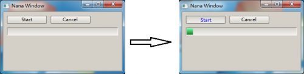
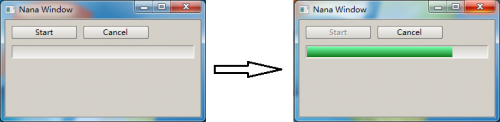

# 8- A Method to prevent UI from blocking while busy #

The GUI of Nana C++ Library (0.1.12 or later) is designed to save developers from the difficulties of threading, however, no UI framework will ever be able to provide a single-threaded solution for every sort of problem.

Most respondence to user interactions in events are finished immediately, and does not affect the responsiveness of the UI. The Nana C++ Library event model deals with events in sequence; this means the next event will be processed after current event is finished.

Consider the following example:

	#include <nana/gui/wvl.hpp>
	#include <nana/gui/widgets/button.hpp>
	#include <nana/gui/widgets/progressbar.hpp>
	class example : public nana::gui::form
	{public:
		example()
		{
			btn_start_.create(*this, 10, 10, 100, 20);
			btn_start_.caption(STR(“Start”));
			btn_start_.make_event<nana::gui::events::click>(*this, &example::_m_start);
			btn_cancel_.create(*this, 120, 10, 100, 20);
			btn_cancel_.caption(STR(“Cancel”));
			btn_cancel_.make_event<nana::gui::events::click>(*this, &example::_m_cancel);
			prog_.create(*this, 10, 40, 280, 20);
		}
	 private:
		void _m_start()
		{
			working_ = true;
			btn_start_.enabled(false);
			prog_.amount(100);
			for(int i = 0; i < 100 && working_; ++i)
			{
				nana::system::sleep(1000); //a long-running simulation
				prog_.value(i + 1);
			}
			btn_start_.enabled(true);
		}
		void _m_cancel(){working_ = false;}

		bool 				working_ ;
		nana::gui::button 	btn_start_ ;
		nana::gui::button 	btn_cancel_ ;
		nana::gui::progressbar prog_ ;
	};

	int main()
	{
		example ex;
		ex.show();
		nana::gui::exec();
		return 0;
	}

This simple application simulates a long-running operation, and designed a button for start and a button for cancel the work. However, it is not difficult to imagine, _m_start() spends a long time to run while click the “Start” button, it does affect the responsiveness of the UI. The “Cancel” button does not work until the work is finish, only thing you can do is just wait.

Usually, the answer to handle the long-running operation in a separate thread, leaving the UI thread free to respond to user interface. When the long-running opertion is complete, it can report its result back to the UI thread for display.

Consider the following solution:

	#include <nana/gui/wvl.hpp>
	#include <nana/gui/widgets/button.hpp>
	#include <nana/gui/widgets/progressbar.hpp>
	#include <nana/threads/pool.hpp>
	class example : public nana::gui::form
	{
	 public:
		example()
		{
			btn_start_.create(*this, 10, 10, 100, 20);
			btn_start_.caption(STR(“Start”));
			btn_start_.make_event<nana::gui::events::click>(nana::threads::pool_push(pool_, *this, &example::_m_start));
			btn_cancel_.create(*this, 120, 10, 100, 20);
			btn_cancel_.caption(STR(“Cancel”));
			btn_cancel_.make_event<nana::gui::events::click>(*this, &example::_m_cancel);
			prog_.create(*this, 10, 40, 280, 20);
			this->make_event<nana::gui::events::unload>(*this, &example::_m_cancel);
		}
	 private:
		void _m_start()
		{
			working_ = true;
			btn_start_.enabled(false);
			prog_.amount(100);
			for(int i = 0; i < 100 && working_; ++i)
			{
				nana::system::sleep(1000); //a long-running simulation
				prog_.value(i + 1);
			}
			btn_start_.enabled(true);
		}
		void _m_cancel()
		{
			working_ = false;
		}
		private:
		volatile bool working_;
		nana::gui::button btn_start_;
		nana::gui::button btn_cancel_;
		nana::gui::progressbar prog_;
		nana::threads::pool pool_;
	};

	int main()
	{
		example ex;
		ex.show();
		nana::gui::exec();
		return 0;
	}

The Nana C++ Library provides a threadpool class. To solute this problem, threadpool can help developer to get rid of thread managment, such as, how to create thread? how to wait for a thread finish? and so on. Compare these tow pieces of code, they are very close, but the most important difference between these tow pieces of code is _m_start() is dispatched to the threadpool and execute in a background thread, the UI thread is not blocking and free to accept new events.

There is a function named pool_push, it creates a pool_pusher function object to push the _m_start() into threadpool. Registering the pool_pusher function object as a button event, the pool_pusher function object will be called to push the _m_start() as a task into threadpool while clicking on the button.

In this version, the form makes an unload event also calling _m_cancel(), when closes the form, the application drops the rest of operations. But there is one question need to be answered, when the long-running operation is working, closing the form will closes the buttons and progressbar, and at the same time, the long-running operation is not finish synchronous, will crash the application when long-running operation calls methods of button and progressbar after closing the form? The anwser is YES, but the code above avoid the destruction of button and progressbar before the finish of _m_start(), the threadpool is defined following buttons and progressbar, this means the threadpool is destructed before the button and the progressbar, when destruct the threadpool, it waits until all worker thread is finish.

Handling a blocking operation with a background thread.

A long time blocking operation is usually uncancellable and not able to get the progress of process. In this situation, application usually updates UI to indicate it is working.

	#include <nana/gui/wvl.hpp>
	#include <nana/gui/widgets/button.hpp>
	#include <nana/gui/widgets/progressbar.hpp>
	#include <nana/threads/pool.hpp>
	class example
	: public nana::gui::form
	{
	 public:
		example()
		{
			btn_start_.create(*this, 10, 10, 100, 20);
			btn_start_.caption(STR(“Start”));
			btn_start_.make_event<nana::gui::events::click>(nana::threads::pool_push(pool_, *this, &example::_m_start));
			btn_start_.make_event<nana::gui::events::click>(nana::threads::pool_push(pool_, *this, &example::_m_ui_update));
			prog_.create(*this, 10, 40, 280, 20);
			prog_.style(false);
		this->make_event<nana::gui::events::unload>(*this, &example::_m_cancel);
		}
	 private:
		void _m_start()
		{
			btn_start_.enabled(false);
			nana::system::sleep(10000); //a blocking simulation
			btn_start_.enabled(true);
		}
		void _m_ui_update()
		{
			while(btn_start_.enabled() == false)
			{
				prog_.inc();
				nana::system::sleep(100);
			}
		}
		void _m_cancel(const nana::gui::eventinfo& ei)
		{
			if(false == btn_start_.enabled())
			ei.unload.cancel = true;
		}
	 private:
		nana::gui::button btn_start_;
		nana::gui::progressbar prog_;
		nana::threads::pool pool_;
	};

	int main()
	{
	example ex;
	ex.show();
	nana::gui::exec();
	return 0;
	}

When click on the start button, application pushs _m_start() and _m_ui_update() into threadpool. It is very easy!

